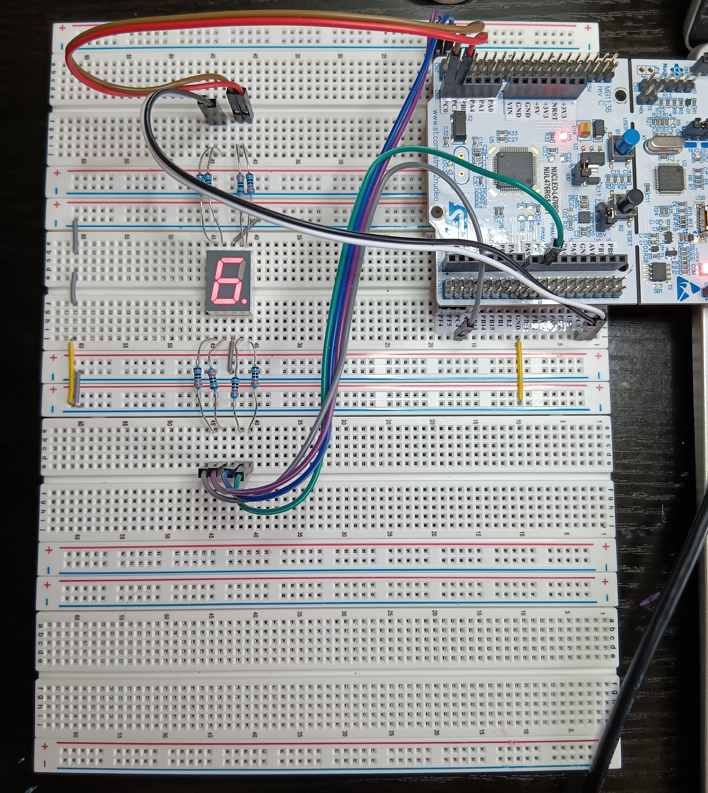
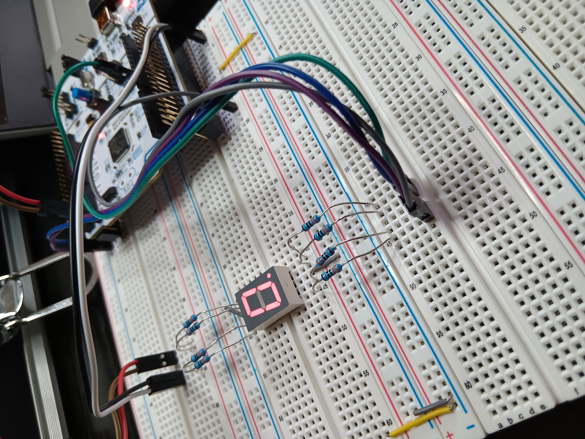

# Single Digit 7-Segment Display

## Overview
This project demonstrates how to drive a single-digit 7-segment LED display using the STM32L476 NUCLEO development board.

The system clock is configured to run at 80 MHz. GPIO pins are configured as outputs using STM32CubeMX, and the display segments are controlled directly through the GPIO Output Data Register (ODR).

The decimal point (DP) is permanently enabled in this project.

## Hardware

STM32 NUCLEO-L476RG Development Board
1-Digit Common Cathode 7-Segment LED Display
8 × 330Ω Resistors
Breadboard
Jumper Wires

## Features

GPIO-based 7-segment control
Direct register manipulation using GPIO ODR
Displays digits 0 to 9
Fixed decimal point display

## Display Encoding Table

| Digit | ODR Value |
|--------|-----------|
| 0 | 0xBF |
| 1 | 0x86 |
| 2 | 0xDB |
| 3 | 0xCF |
| 4 | 0xE6 |
| 5 | 0xED |
| 6 | 0xFD |
| 7 | 0x87 |
| 8 | 0xFF |
| 9 | 0xEF |

## Project Structure

Core/

Drivers/

Docs/

Images/

## Images

## Documentation

[Schematic PDF](Single_Digit_7_Segment/Docs/single_digit_7_segment_schematic.pdf)

